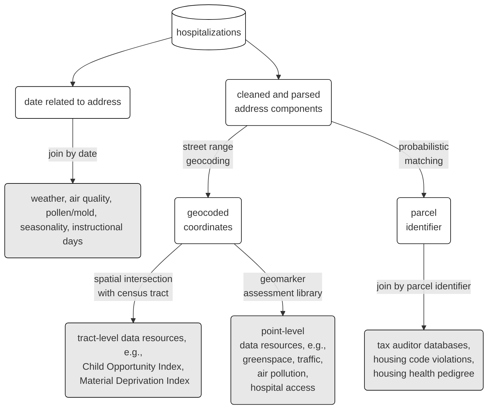

# RISEUP Geomarker Pipeline

This is a pipeline for appending place- and date- based geomarker data from multiple data sources at multiple geographic and temporal resolutions, with a specific focus on Hamilton County, Ohio:



## Data

See the [metadata](data/riseup_geomarker_pipeline/tabular-data-resource.yaml) for information about specific data elements and sources.

*Notes:*

- Patient addresses are constructed by pasting together `ADDRESS`, `CITY`, `STATE`, `ZIP` fields
- `hh_acs_measures` has annual measures, but measures from 2019 are used here

#### Time Data Availability Notes

| Data                                                                      | Min Date   | Max Date   | Frequency                                         | Data Availability Lag |
|--------------------------|------------|------------|-----------|-------------|
| AQI                                                                       | 2015-01-01 | 2022-10-01 | daily                                             | 6 months              |
| weather                 | 2015-01-01 | 2022-09-30 | daily                                             | 6 months              |
| pollen and mold | 2021-02-17 | 2022-12-09 | random (skips weekends, some random days missing) | unknown |
| shotspotter (only for Avondale, E. Price Hill, and W. Price Hill) | 2017-08-16 | 2023-01-03 | daily                                             | daily                 |

## Running & Developing

1. Clone github repository to destination; manually move input health data into place (`DR1767_r2.csv`)
1. Install `pak` (`install.packages("pak", repos = sprintf("https://r-lib.github.io/p/pak/stable/%s/%s/%s", .Platform$pkgType, R.Version()$os, R.Version()$arch))`)
1. Install all packages from DESCRIPTION file by running `pak::pak()` *or* `remotes::install_deps()` in the project root from R. (If you are on a linux machine, speed up installation to use binaries hosted by Posit, by setting `options("repos" = c("CRAN" = "https://packagemanager.rstudio.com/all/__linux__/jammy/latest"))`, substituting `jammy` for your specific linux version.)
1. Install required python libraries. (Use `reticulate::py_config()` to check on available python environments):
```R
reticulate::py_install("usaddress", pip = TRUE)
reticulate::py_install("dedupe", pip = TRUE)
reticulate::py_install("dedupe-variable-address", pip = TRUE)
```
1. Use `make` to create targets defined in `Makefile` or `make tdr` to create the final output as a tabular data resource. *`docker` is required to run the `geocode` and `geomark` targets.* 

To specify the python executable to use for the pipeline without using R, set an environment variable in the shell being used to call `make`:

```sh
export RETICULATE_PYTHON=~/.virtualenvs/r-parcel/bin/python
make all
```

*Notes:*

- `/data` is for any output data associated with a participant *and/or* the raw hospital admissions file; any `*.rds` or `*.csv` files in this directory will always be git ignored
- `/data-raw` is for raw (e.g., violations spreadsheet) or intermediate data products (e.g., daily AQI) that are tracked using git
- `Makefile` defines the pipeline, see other high level targets there
