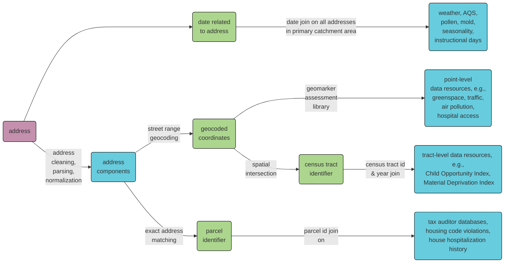

## RISEUP Geomarker Pipeline

This code is used to append place- and date- based geomarker data from multiple data sources at multiple geographic and temporal resolutions, with a specific focus on Hamilton County, Ohio:

### Data sources
  
- [DeGAUSS Geomarker Library](https://degauss.org/)
- [Census Tract-Level Neighborhood Indices](https://github.com/geomarker-io/tract_indices/#census-tract-level-neighborhood-indices)
- [American Community Survey (ACS) Data](https://www.census.gov/programs-surveys/acs/data.html)
- [Applied Geographic Solutions (AGS) Crime Risk](https://appliedgeographic.com/crimerisk/)
- [National Land Cover Database (NLCD)](https://www.usgs.gov/centers/eros/science/national-land-cover-database)
- [Cincinnati Area Geographic Information System (CAGIS) Parcel Data](https://data-cagisportal.opendata.arcgis.com/)

### Data Notes

- Patient address was constructed by pasting together `pat_addr_1`, `pat_city`, `pat_state`, `pat_zip`
- All Harmonized Historial ACS Measures are from 2019 (but this could be changed)

#### Time Data Availability Notes

| Data                                                                      | Min Date   | Max Date   | Frequency                                         | Data Availability Lag |
|--------------------------|------------|------------|-----------|-------------|
| AQI                                                                       | 2015-01-01 | 2022-10-01 | daily                                             | 6 months              |
| Weather (wind speed and direction, temperature, humidity)                 | 2015-01-01 | 2022-09-30 | daily                                             | 6 months              |
| Pollen and Mold (total counts \* factor)                                  | 2021-02-17 | 2022-12-09 | random (skips weekends, some random days missing) | unknown               |
| Shotspotter (number shots for Avondale, E. Price Hill, and W. Price Hill) | 2017-08-16 | 2023-01-03 | daily                                             | daily                 |

### Developing

- `/data` is for any output data associated with a participant *and/or* the raw hospital admissions file; this entire directory will always be git ignored
- `/data-raw` is for raw (e.g., violations spreadsheet) or intermediate data products (e.g., daily AQI) that are tracked using git
- `Makefile` defines the pipeline, see high level targets there
