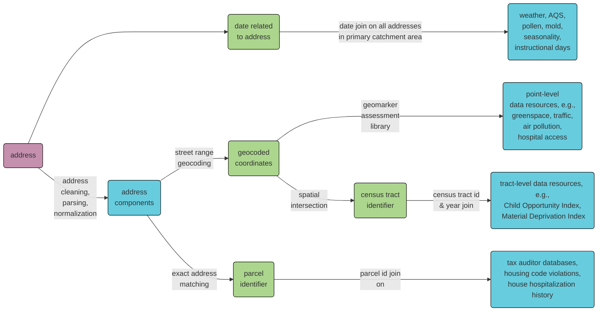

## RISEUP Geomarker Pipeline

This group of R scripts is used to create a dataset by compiling geospatial data from multiple data sources at census tract level and parcel level.

### Data sources
  
- [DeGAUSS Geomarker Library](https://degauss.org/)
- [Census Tract-Level Neighborhood Indices](https://github.com/geomarker-io/tract_indices/#census-tract-level-neighborhood-indices)
- [American Community Survey (ACS) Data](https://www.census.gov/programs-surveys/acs/data.html)
- [Applied Geographic Solutions (AGS) Crime Risk](https://appliedgeographic.com/crimerisk/)
- [National Land Cover Database (NLCD)](https://www.usgs.gov/centers/eros/science/national-land-cover-database)
- [Cincinnati Area Geographic Information System (CAGIS) Parcel Data](https://data-cagisportal.opendata.arcgis.com/)

### Note
- Addresses used for geocoding were created based on variables, "pat_addr_1", "pat_city", "pat_state", "pat_zip", in the current dataset.

- 2019 5-Year ACS Data (2014-19) was used.

- AGS Crime Risk and CAGIS parcel data included in the dataset are available for Hamilton county only.

### Creating Month-Race-Tract Data

`scripts/aggregate_admissions_data.R` takes in the geocoded data and produces a summary of admissions by month, race (Black or African American vs. Other), and census tract.

